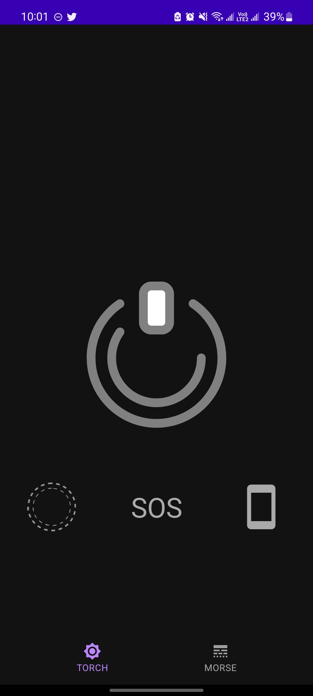
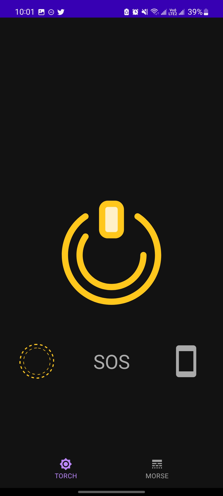

An Light is a useful flashlight,It quickly and easily turns on the flashlight.

## Feature
<ol>
<li>Quick start</li>
<li>The flashlight work when the screen is off</li>
<li>Built-in SOS flashlight signal</li>
<li>Strobe mode</li>
<li>Support Morse Code</li>
</ol>

 
